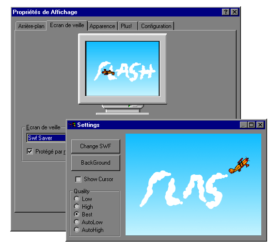



## Any Flash Movie for Screen saver \!

### Description

Transform any SWF file in a screen saver !

You can configure Quality and BackGround Color

See the result with the Screen Shot (plane.swf sample)
 
### More Info
 

             |
---                |---
**Submitted On**   |2000-08-08 13:13:58
**By**             |[FredJust](https://github.com/Planet-Source-Code/PSCIndex/blob/master/ByAuthor/fredjust.md)
**Level**          |Intermediate
**User Rating**    |4.6 (23 globes from 5 users)
**Compatibility**  |VB 5\.0, VB 6\.0
**Category**       |[Graphics](https://github.com/Planet-Source-Code/PSCIndex/blob/master/ByCategory/graphics__1-46.md)
**World**          |[Visual Basic](https://github.com/Planet-Source-Code/PSCIndex/blob/master/ByWorld/visual-basic.md)
**Archive File**   |[CODE\_UPLOAD8744882000\.zip](https://github.com/Planet-Source-Code/fredjust-any-flash-movie-for-screen-saver__1-10517/archive/master.zip)

